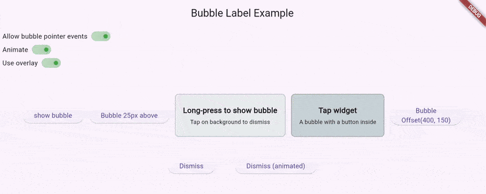

# Bubble Label Example

This example demonstrates how to use the `bubble_label` package in a simple Flutter application.

Usage:

1. From the package root, run the example app:

```bash
cd example
flutter run
```

2. Tap the `Tap to show bubble` button to reveal the floating bubble label anchored to the button.

3. The example also includes additional controls to:
	- Toggle pointer behavior (whether the bubble blocks pointer events)
	- Toggle animations (animate show/dismiss)
	- Toggle overlay usage
	- Show a bubble without overlay and a long-press area to show the bubble
	- Buttons to `Dismiss` (immediate) and `Dismiss (animated)` are provided to hide the bubble.

This example mirrors the code used in the package README and tests and illustrates the recommended usage patterns – using `childWidgetRenderBox` or `positionOverride` – to make it easy to explore the package.

Example animation preview:


